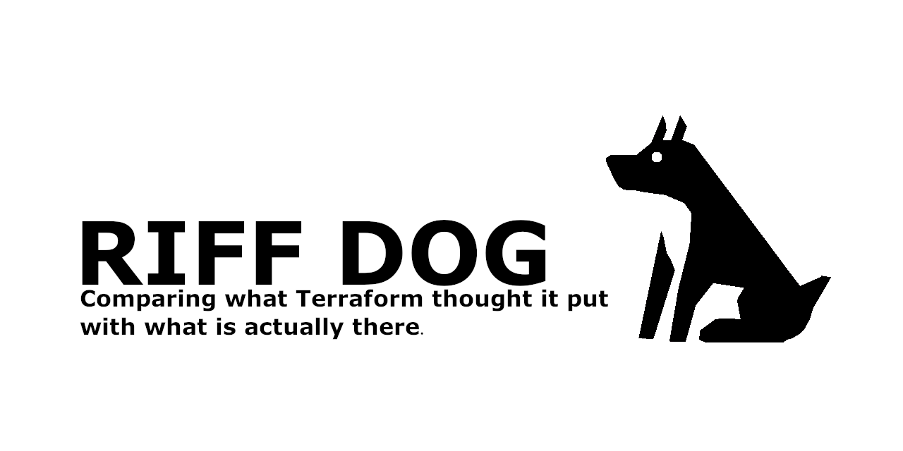
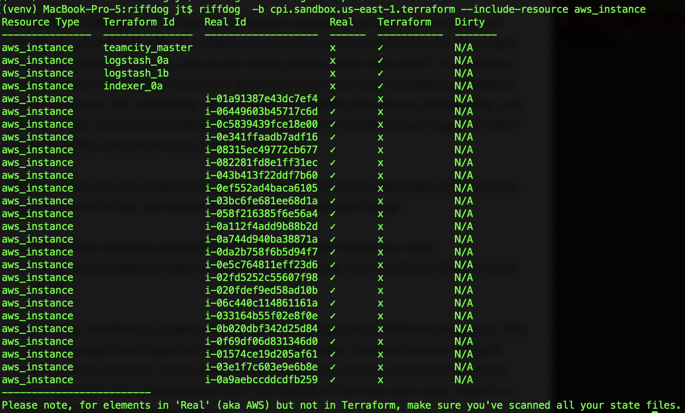

Welcome to Riffdog
===================================

.. toctree::
   :maxdepth: 2
   :caption: Contents:
   :hidden:
   
   self
   commandline
   versionhistory
   code_reference

.. raw: html
   
   <iframe width="560" height="315" src="https://www.youtube.com/embed/2pPpNCvshqM" frameborder="0" allow="accelerometer; autoplay; encrypted-media; gyroscope; picture-in-picture" allowfullscreen></iframe>

Welcome to Riffdog. One of the big challanges organisations have when rolling out Terraform, and indeed once it is rolled out, is what is and isn't terraformed. In an ideal world, everything would be, but we are nearly always not in that world - for instance, you may have a mixture of resources, and there may have been emergency situations which someone 'did' something, and you need to identify the impact of that thing, and on top of this, there are situations where an operator or an admin just forgot, or didn't know that this component was now Terraformed.

Riffdog allows you to compare the output from Terraform (its state files to be precise), against what is in the 'real world'. So this works to find two things: 

1) Things that terraform thought it put there, that arn't there any more
2) Things that people (or other systems) have put there, that Terraform doesn't know about.

Please note, terraform is a *giant* project containing many many different resources. This is a young project and does not cover all those resources, however we are trying to cover the main usecases. If you have issues, please let us know, because if you have issues, someone else probably does too, but outside of our own use-cases, there is a near infinite number of edge cases.

Core Team
=========

.. table::
   :widths: 33 33 33
   :align: center
   :width: 100

   +-----------------------------------------+----------------------------------------------------------+----------------------------------------------------------+
   |                  |jt|                   |                          |jamie|                         |                          |dave|                          |
   +-----------------------------------------+----------------------------------------------------------+----------------------------------------------------------+
   | `@jmons <https://twitter.com/jmons/>`_  | `@jamie_ian_west <https://twitter.com/jamie_ian_west/>`_ | `@davidtreynolds <https://twitter.com/davidtreynolds/>`_ |
   +-----------------------------------------+----------------------------------------------------------+----------------------------------------------------------+

.. raw:: html
   
   

Using Riffdog Quick start
=========================

Riffdog is both a command line tool and a python library. However, you must install at least one 'resource pack' (e.g. AWS) to scan your items.

To install (for example with the AWS resources)

``$ pip install riffdog[aws]``

To run:

``$ riffdog -b bucketname_containing_states``

Note this may generate a lot of output, and can be quite slow to run, so you may only be interested in one or two types of things: to make this faster, try with the ``--include-resource`` argument, using the terraform types, e.g.:

``$ riffdog -b bucketname_containing_states --include-resource aws_instance``

This should produce output that looks similar to this:

Where to go now
===============

* :ref:`genindex`
* :ref:`modindex`
* :ref:`search`

